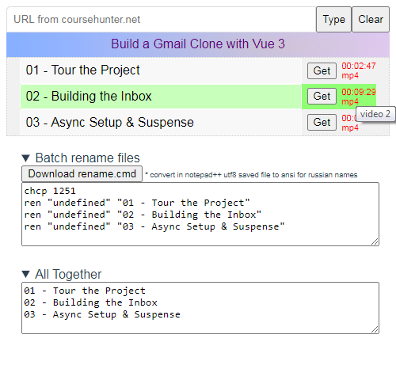

# Overview

Application to grab video links from the [coursehunter](https://coursehunter.net) wbsite. This app can be easily customized by changing htmlToItems() implementation to scrap items from any webpage.



## Project setup
```
yarn install
```

### Compiles and hot-reloads for development
```
yarn serve
```

### Compiles and minifies for production
```
yarn build
```

# Docs

TODO
